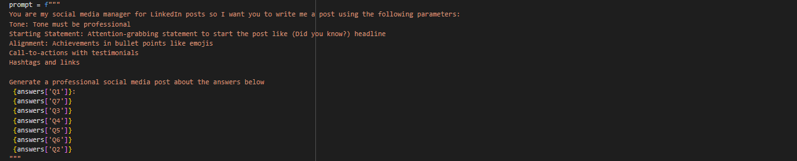

<h1>Social Media Post Generator</h1>

How do i write the prompt?

<h3>Steps</h3>
<ul>
<li>We need to tell our context to the model</li>
<li>Tone is the most important thing to set up</li>
<li>The Task we are going to assign to the model</li>
<li>Examples for the given context to not to generate generic post</li>
</ul>

<h3>Prompt I Wrote</h3>

The answer(Q(n)) is a dictionary initialized with users given answer of questionare and passed to the prompt

