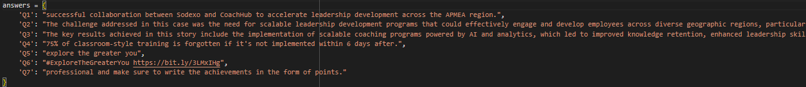
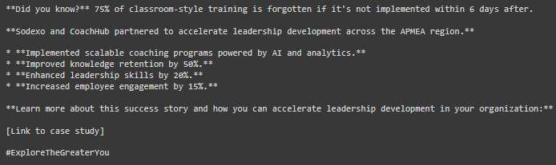
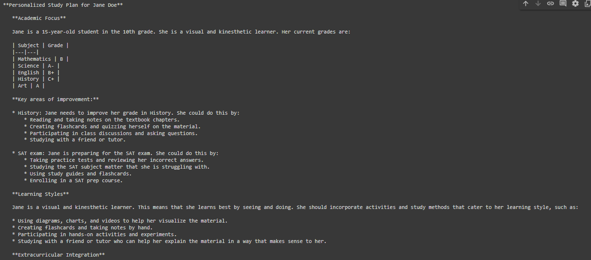
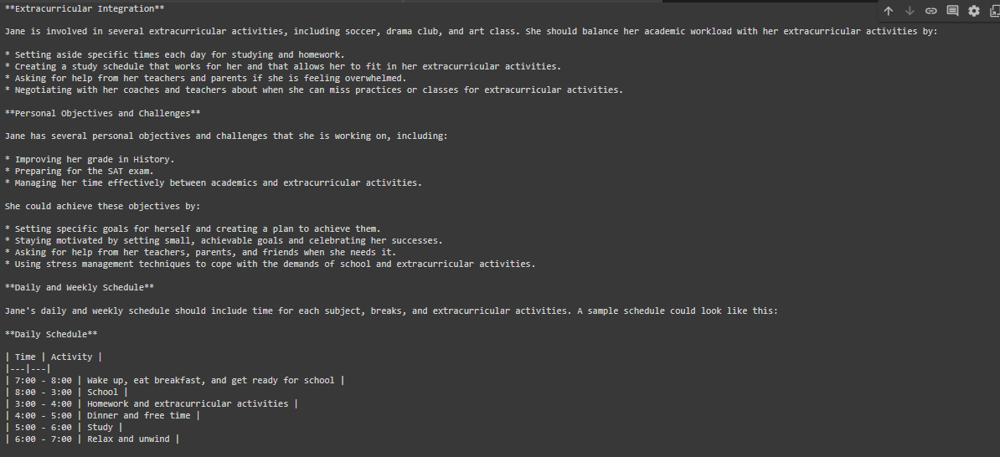
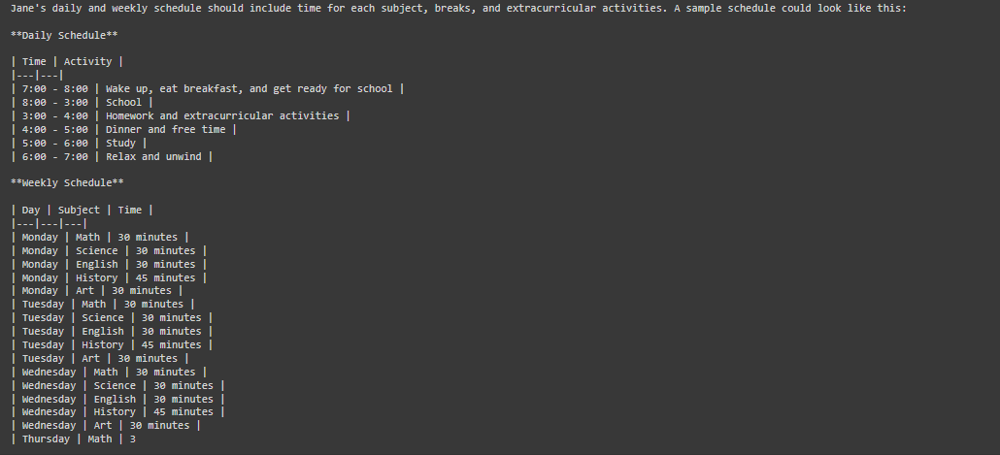

<h2>Cogent Labs Tasks</h2>
<h3>Technologies Used</h3>
<ul>
  <li>Python</li>
  <li>Gemini-models/text-bison-001</li>
  <li>LangChain</li>
  <li>Jupyter Notebook</li>
</ul>
<h3>File Names</h3>
<ul>
  <li><b>Taks_1_Social_Media_Post_Generator</b></li>
  <li><b>Taks_2_Time_Table_Generator</b></li>
<h1>1. Social Media Post Generator</h1>

How do i write the prompt?

<h3>Steps</h3>
<ul>
<li>We need to tell our context to the model</li>
<li>Tone is the most important thing to set up</li>
<li>The Task we are going to assign to the model</li>
<li>Examples for the given context to not to generate generic post</li>
</ul>

<h3>Prompt I Wrote</h3>
<b>prompt = f"""
  
  You are my social media manager for LinkedIn posts so I want you to write me a post using the following parameters:
  Tone: Tone must be professional
  Starting Statement: Attention-grabbing statement to start the post like (Did you know?) headline
  Alignment: Achievements in bullet points like emojis
  Call-to-actions with testimonials
  Hashtags and links

  Generate a professional social media post about the answers below
   {answers['Q1']}:
   {answers['Q7']}
   {answers['Q3']}
   {answers['Q4']}
   {answers['Q5']}
   {answers['Q6']}
   {answers['Q2']}
  """</b>

The answer(Q(n)) is a dictionary initialized with users given answer of questionare and passed to the prompt

<h3>Answer's Dictionary</h3>

<h3>LLM Response</h3>

<h1>2. Timetable Generator Task</h1>

 How do i write the prompt? 

<h3>Steps</h3>
<ul>
  <li>Firstly i tell the model the task and context like to <b>Create the personalized Time Table for the Student</b></li>
  <li>Then I provided the student information like <b>Personalized Details</b>, <b>Academic Performance</b>, <b>Learning Styles</b>, <b>Extracurricular Activities</b>, and <b>Personal Objectives or Challenges</b></li>
  <li>Thirdly, I gave the guidelines like how the time table will look like and at the end i set the time into the tabular form</li>
</ul>

<h3>Prompt</h3>

<b>
prompt = f""" 
  
    Analyze the following student-specific data and create a personalized study plan. The plan should address academic requirements, preferred learning styles, extracurricular activities, and distinct personal objectives or challenges. Ensure the study plan aligns with the student's unique needs and aspirations.
    Student Information:
  
    Personal Details:
  
     Name: {student_info['name']}
  
     Age: {student_info['age']}
  
     Grade Level: {student_info['grade_level']}
  
    Academic Performance:
  
     Subjects and Grades: {student_info['subjects_and_grades'].items()}
  
     Learning Styles:
  
     Primary Learning Style: {student_info['learning_styles']['primary']}
  
     Secondary Learning Style: {student_info['learning_styles']['secondary']}
  
    Extracurricular Activities: {student_info['extracurricular_activities']}
  
    Personal Objectives or Challenges: {student_info['personal_objectives_or_challenges']}
  
    Guidelines for Creating the Study Plan:
    1. Academic Focus:
       Identify key areas of improvement in each subject based on current grades.
       Recommend study resources and techniques aligned with the student's learning style.
       Allocate time for each subject, with more emphasis on subjects where the student needs improvement.
     2. Learning Styles:
       - Incorporate activities and study methods that cater to the student's primary and secondary learning styles.
         - For Visual learners: Suggest using diagrams, charts, and videos.
         - For Auditory learners: Recommend listening to lectures, discussions, and using mnemonic devices.
         - For Kinesthetic learners: Encourage hands-on activities, experiments, and movement-based learning.

    3. Extracurricular Integration:
       - Balance academic workload with extracurricular activities.
       - Suggest how extracurricular activities can complement academic learning (e.g., sports for kinesthetic learners, debate club for auditory learners).

    4. Personal Objectives and Challenges:
       - Provide strategies to achieve specific personal objectives (e.g., preparing for a specific exam).
       - Offer solutions to overcome learning difficulties (e.g., using assistive technology for students with dyslexia).
       - Include motivational tips and stress management techniques.

    5. Daily and Weekly Schedule:
       - Outline a daily and weekly study schedule that includes time for each subject, breaks, and extracurricular activities.
       - Ensure the schedule is realistic and manageable, allowing for flexibility and adjustment as needed.

    6. Progress Tracking:
       - Suggest methods for tracking progress in each subject (e.g., regular quizzes, self-assessment tools).
       - Recommend periodic reviews and adjustments to the study plan based on progress and feedback

    Now create a personalized study plan for the student based on the provided information in the tabular form
    """
</b>
<h3>LLM Response</h3>

<h4>Note: This information can be taken as input so every student have seperate and specified Timetable</h4>
